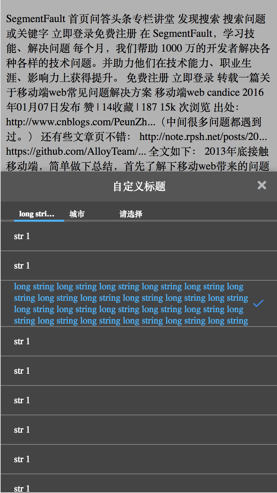

# multi-level-poppicker
A multi level cascade popup picker inspired by mui.




# Install
    npm i multi-level-poppicker

# Usage

You can refer https://github.com/yayayahei/mlpicker-test or:
## create your html
```
<!DOCTYPE html>
<html>
<head>

    <meta http-equiv="Content-Type" content="text/html; charset=utf-8" />
    <meta name="viewport" content="width=device-width,initial-scale=1.0,maximum-scale=1.0,user-scalable=0" />
    <link rel="stylesheet" href="css/index.css">
    <script src="index.js"></script>
</head>

<body>
    <button id='pop' style="border: 1px solid black;">picker</button>
</body>

</html>
```

## copy css to your assets
if you use gulp:

    gulp.src(["node_modules/multi-level-poppicker/dist/css/**"]).pipe(gulp.dest("public/css/"));

for other build tools, please refer to it's document.

## create your index.js
```
import MultiLevelPopPicker from 'multi-level-poppicker';
fetch('./data.json')
  .then(function(response) {
    return response.json();
  })
  .then(function(myJson) {
    console.log(myJson);

             var city_picker = new MultiLevelPopPicker({
                    panelTitle: '自定义标题',
                    layer: 3,
                    titleWidthLayer: [20, 20, 45],
                    defaultTitles: ['省份', '城市', '请选择']
                });
                city_picker.setData(myJson.d);
                
                document.getElementById('pop').onclick = function (ev) {
                    city_picker.show(function (items) {
                        var result=items.map(function (a) {
                            return a.text
                        }).join(' ');
                        // console.log(result);
                    });
                };
                document.getElementById('pop').click();
  });
```
then build your code to run 

# test
after clone this repo, you can run 

    npm test
then open http://localhost:3333, there it is.
